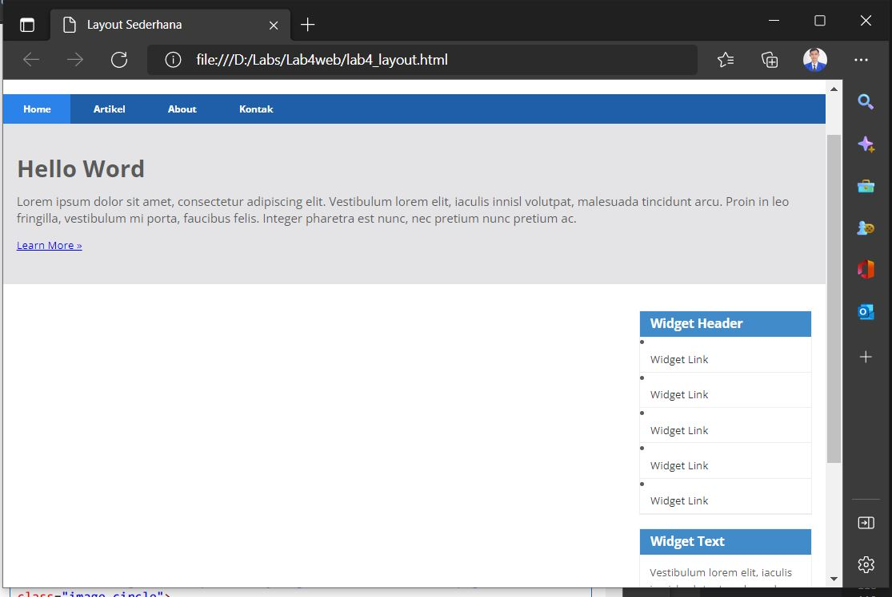
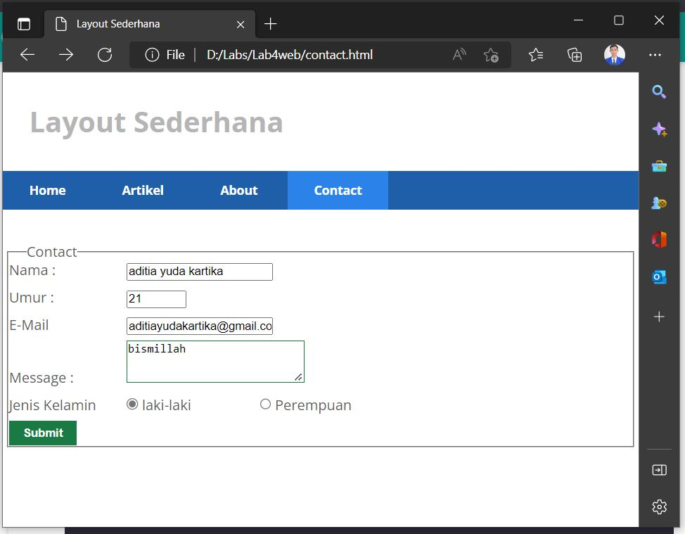

# Lab4web
# praktikum 4

# CSS layout
* Membuat Box element.
    - berikut adalah tampilannya:

* Mengatur Clearfix element
    - berikut adalah tampilannya:

# MEMBUAT LAYOUT SEDERHANA #

* Membuat kerangka layout
    - berikut adlah hasilnya:

* Menambahkan Kode CSS.
- tampilan berubah setelah penambahan kode css.
    - berikut adalah hasilnya:

* Membuat Navigasi
    - berikut adalah hasilnya:

* Membuat hero panel
- berikut adalah hasilnya:

* Mengatur layout dan sidebar
    - berikut adalah hasilnya:

* Membuat Footer
    - berikut adalah hasilnya:

* Menambahkan elemen lainnya pada main content
    - berikut adalah hasilnya

* Menambahkan konten artikel
    - berikut adalah hasilnya:

# __TUGAS__ #

* Menambahkan layout untuk menu About.
    - single layout deskripsi dan my portofolio.
    berikut adalah hasilnya:
1[img 10](screen/b10.JPG)

* Tambahkan layout untuk menu Contact
    - membuat form isian.
    berikut adalah haslnya:

# TERIMAKASIH